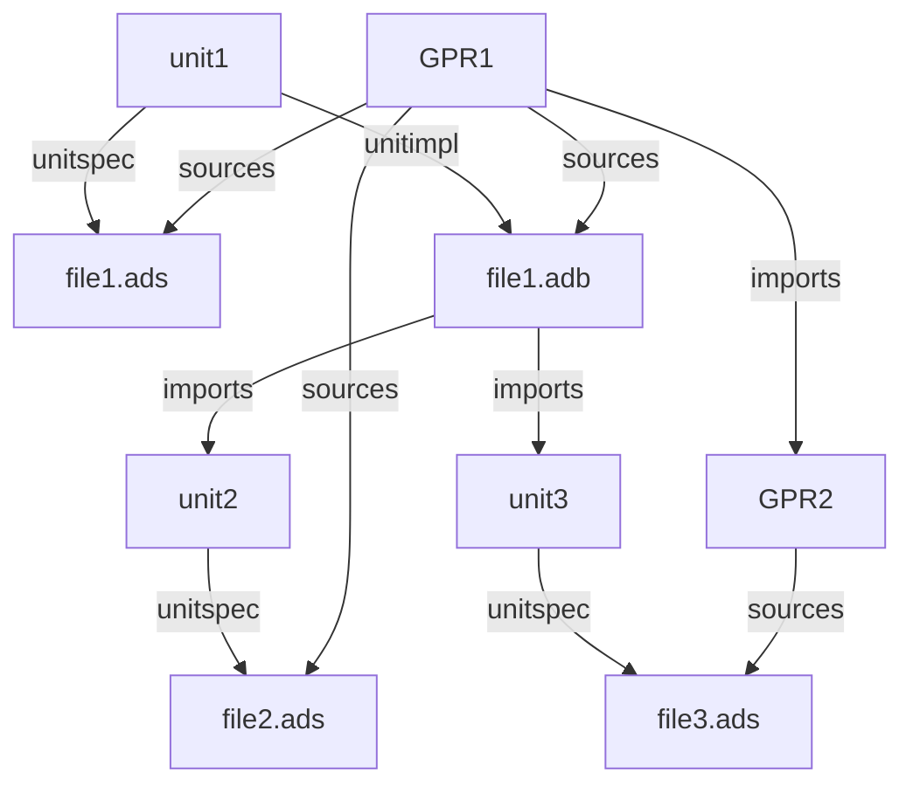

# gprdeps
Dependency-graph builder for AdaCore's GPR files

## Goal

This tool will parse one or more projects, written in the
format used by AdaCore for the GNAT compiler and the gprbuild
tool.

From these projects, we gather a large dependency graph, which
let's us perform various queries, like finding all unused files.

All dependencies are computed for all possible scenarios.  For
instance, it is possible that some tasking-related files are not
including when building without tasking, or that it has a different
implementation in this case.

## Usage

### Specify projects

The most important switch is `--root R`.  It can be repeated several
times.  Each of the R parameters can be either:

- a project file:  it will be parsed, along with all the projects it imports.

- a directory: all project files in this directory or child directories will
  be parsed.

If you are using symbolic links, you should also use the `--symlinks`, so
that they are properly resolve and the tool can detect when the same file is
viewed from different directories.

Parsing a project implies evaluating the values of all its attributes in all
possible scenarios.  So if your project depends on a MODE variable (e.g.
"debug" or "release") and a TASKING variable ("on" or "off"), then the values
of attributes might be different for all possible combinations of those
variables.

Then we find all the source files (using the naming scheme described in
the project), parse them to find which files they import (this works for Ada
and C files at this stage).

The result of this process is a large graph that looks like the following.  Note
that all links have a "scenario" attribute which indicates in which
circumstances the link is valid.


### Statistics

The simplest command is
```
   gprdeps --root everything.gpr stats
```

which will display statistics about the graph, like the number of nodes (for
GPR files, units or source files), the number of edges,...

### Find unused source files

By using
```
   gprdeps --root everything.gpr unused
```

you will get a list of source files that are not imported by any other
file, and that are not main units or library interface of projects.  In general,
those source files can simply be deleted.

You might however wish to keep them, but avoid seeing them in future runs of
the tool.  For this, you can pass additional switches:

```
   gprdeps --root everything.gpr unused --unused path/to/unused.txt:/root
```

The `--unused` switch can be used multiple times as needed.  It will parse
`path/to/unused.txt` (which we expect to contain one file per line, and lines
starting with '#' are ignored).  All file paths are relative to `/root` in the
example above (so that this file can be committed in git and is applicable on
other machines).

You can also chose to ignore whole subdirectories, typically those corresponding
to third party libraries that you depend on.  For this, use

```
   gprdeps --root everything.gpr unused  --ignore /directory
```

Finally, files that are only imported by otherwise unused files (for instance
a.adb imports b.ads, but a.adb has been found to be unused) will be reported
by default.  By using `--no_recurse` you can chose to not display `b.ads` in
this example.

### Source dependencies

gprdeps provides a number of commands to analyze source dependencies.

First, you can find which files are imported, possibly indirectly, by a given
source file.
```
   gprdeps --root everything.gpr source imported_by /path/to/source.adb
```

Alternatively, you can find which other files depend on a given one, using
```
   gprdeps --root everything.gpr source import /path/to/source.adb
```

And finally, can see how a file depends on another one
```
   > gprdeps --root everything.gpr path /path/to/source.adb /path/to/target.adb
   /path/to/source.adb
   /path/to/file1.ads
   /path/to/file2.ads
   /path/to/target.adb
```
which indicates that "source.adb" has a "with File1", which itself has a "with
File2", which in turn has a "with Target".

### View expanded projects

The command
```
    gprdeps --root everything.gpr gpr show /path/to/prj.gpr
```

will display the contents of the project file, with attribute values
expanded for all scenarios.  So for instance you might see something
like

```
project data_server is
   for <top>'source_dirs
      tasking=off ., private, tasking-off
      tasking=on  ., private, tasking-on
end data_server
```

to indicate that when the scenario variable "tasking" is set to off, we
have the following source directories "(., private, tasking-off)", but
we have a different list when tasking is on.

By default, you will see all attributes.  Depending on the complexity of
your project, this might result in a very large display.  You can use the
`--trim` switch to omit some of the attributes (like compilation switches
for instance).  The exact list of switches that are hidden might change
in the future.
